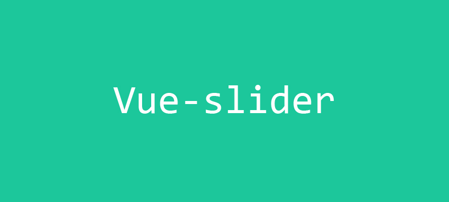

English | [中文](README.md)

[](https://www.npmjs.com/package/vue-concise-slider)
[](https://www.npmjs.com/package/vue-concise-slider)
[](https://www.npmjs.com/package/vue-concise-slider)

## vue-concise-slider.js

* * *

vue-concise-slider,A simple sliding component,has easy configuration,support self-adaption / fullscreen / button / page,and is compatible with mobile and PC terminal

### version
v2.1.2  Supported vue2.0+

### Achieved
- [x] Self-adaption Fullscreen
- [x] Compatible with mobile and PC terminal
- [x] Vertical Slides
- [x] Autoplay Slides
- [x] Auto Slides Per View / Carousel Mode
- [x] Loop Mode / Infinite Loop
- [x] Loop Mode / multiple slide

### To Do List
- [ ] Fade Effect
- [ ] Parallax

### Example

[demo](https://warpcgd.github.io/vue-concise-slider/index.html)</br>
[full documents](https://github.com/warpcgd/vue-concise-slider/tree/gh-pages)

### Installation

```html
  npm install vue-concise-slider --save
```

### How to use it

```html
<template>
  <slider :pages="pages" :sliderinit="sliderinit">
    <!-- slot  -->
  </slider>
</template>

<script>
import slider from 'vue-concise-slider'// import slider component
export default {
   el: '#app',
   data () {
      return {
        // List of pictures [arr]
        pages:[
          {
            title: '',
            style:{
             background:'url(src/img/testimg-1.jpg)'
            }
          },
          {
           title: '',
           style:{
            background:'url(src/img/testimg-2.jpg)'
            }
          },
          {
            title: 'slide3',
            style:{
              background:'#4bbfc3',
            },
          }
        ],
        //Slider configuration[obj]
        sliderinit: {
          currentPage: 0,//current Page of slider
          thresholdDistance: 500,//Minimal distance (in px) to trigger swipe to next/previous slide during swipes
          thresholdTime: 100,//Minimal duration (in ms) to trigger swipe to next/previous slide during swipes
          autoplay:1000,//delay between transitions (in ms).
          loop:true//Set to true to enable continuous loop mode
          direction:'vertical'//Could be 'horizontal' or 'vertical' (for vertical slider).
        }
      }
    },
    components: {
        slider
    }
}
</script>

```
### Pages / Initialize parameter
<table width="100%">
<thead>
  <tr>
    <th width="20%">Option</th>
    <th width="15%">Type</th>
    <th width="15%">Default</th>
    <th width="50%">Description</th>
  </tr>
</thead>
<tbody>
  <tr align="center">
    <td><code>title</code></td>
    <td>string</td>
    <td>-</td>
    <td>Now it is every page's title , will be echo HTML in the future.</td>
  </tr>
  <tr align="center">
    <td><code>style</code></td>
    <td>obj</td>
    <td>-</td>
    <td>Attribute in style will be show in page css of sliders,so you can add background/background-color,even font-size or other style to page,of course slider would calculate page's width,so you may not set width of page </td>
  </tr>
 </tbody>
</table>

### Sliderinit / Initialize parameter

<table width="100%">
<thead>
  <tr>
    <th width="20%">Option</th>
    <th width="15%">Type</th>
    <th width="15%">Default</th>
    <th width="50%">Description</th>
  </tr>
</thead>
<tbody>
  <tr align="center">
    <td><code>direction</code></td>
    <td>string</td>
    <td>'horizontal'</td>
    <td>Could be 'horizontal' or 'vertical' (for vertical slider).</td>
  </tr>
  <tr align="center">
    <td><code>currentPage</code></td>
    <td>number</td>
    <td>-</td>
    <td>Initing current Page of slider</td>
  </tr>
  <tr align="center">
    <td><code>thresholdDistance</code></td>
    <td>number</td>
    <td>-</td>
    <td>Minimal distance (in px) to trigger swipe to next/previous slide during swipes</td>
  </tr>
  <tr align="center">
    <td><code>thresholdTime</code></td>
    <td>number</td>
    <td>-</td>
    <td>Minimal duration (in ms) to trigger swipe to next/previous slide during swipes</td>
  </tr>
  <tr align="center">
    <td><code>autoplay</code></td>
    <td>number[ms]</td>
    <td>-</td>
    <td>delay between transitions (in ms).</td>
  </tr>
  <tr align="center">
    <td><code>loop</code></td>
    <td>boolean</td>
    <td>false</td>
    <td>Set to true to enable continuous loop mode</td>
  </tr>
  <tr align="center">
    <td><code>infinite</code></td>
    <td>number</td>
    <td>1</td>
    <td>like carousel, works with multiple slides</td>
  </tr>
  <tr align="center">
    <td><code>slidesToScroll</code></td>
    <td>number</td>
    <td>1</td>
    <td>slides scrolled at once</td>
  </tr>
 </tbody>
</table>

### API / Self-Events

<table width="100%" align="center">
<thead>
  <tr>
    <th align="center" width="12.5%">Method</th>
    <th align="center" width="12.5%">Parameters</th>
    <th align="center" width="35%">Description</th>
    <th align="center" width="40%">Example</th>
  </tr>
</thead>
<tbody>
  <tr align="center">
    <td><code>slideTo</code></td>
    <td>number</td>
    <td>slide to (number) page</td>
    <td><code>childComponents.$emit('slideTo', num)</code></td>
  </tr>
 <tr align="center">
    <td><code>slideNext</code></td>
    <td>-</td>
    <td>next page</td>
    <td><code>childComponents.$emit('slideNext')</code></td>
  </tr>
  <tr align="center">
    <td><code>slideTo</code></td>
    <td>-</td>
    <td>prev page</td>
    <td><code>childComponents.$emit('slidePre')</code></td>
  </tr>
 </tbody>
</table>

### API / Parents-Event

<table width="100%" align="center">
<thead>
  <tr>
    <th align="center" width="12.5%">Method</th>
    <th align="center" width="12.5%">Parameters</th>
    <th align="center" width="35%">Description</th>
    <th align="center" width="40%">Example</th>
  </tr>
</thead>
<tbody>
  <tr align="center">
    <td><code>slide</code></td>
    <td>number</td>
    <td>every slide handle even success or false can trigger this,and tell us now num of page</td>
    <td><code>childComponents.$on('slide', function(pagenum){console.log(pagenum)})</code></td>
  </tr>
  <tr align="center">
    <td><code>tap</code></td>
    <td>number</td>
    <td>Event will be fired when user click/tap on Slider.</td>
    <td><code>childComponents.$on('tap', function(pagenum){console.log(pagenum)})</code></td>
  </tr>
 </tbody>
</table>

### Have a better idea？
Welcome to leave your opinion:https://github.com/warpcgd/vue-concise-slider/issues/1

### BUG？oh no!
You can be submitted here, and i will be dealt with as soon as possible:https://github.com/warpcgd/vue-concise-slider/issues/2
